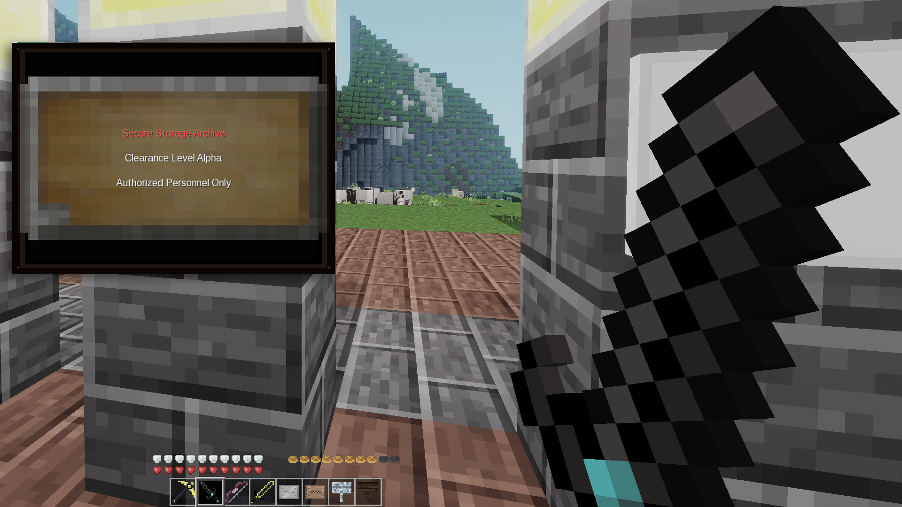

# WaySigns



> [!NOTE]
> **Signs Are Not Included**: WaySigns does not add new signs or sign nodes to the game. If you need signs to place in your world, please install any standard signs mod (such as `default` signs in Minetest Game, `signs_lib`, `basic_signs`, `street_signs`, `display_modpack`, `signs_rx`, `mcl_signs`, etc.). WaySigns enhances your gameplay by eliminating lag-inducing text entities from those mods and providing high-performance, accessible in-world HUD sign reading.

**WaySigns** is a lightweight, immersive sign-reading mod for Luanti (formerly Minetest). When a player points their crosshair at a sign from within 4.5 blocks distance, the sign's text dynamically appears as an in-world 3D HUD waypoint floating smoothly in front of the sign, rendered on top of a dynamic plaque background derived from the sign's own wood or metal texture!

---

## Features

- **In-World HUD Waypoint**: Anchored directly in front of the sign face in 3D world space, maintaining natural immersion.
- **Dynamic Background Texture**: Automatically tiles the sign's base texture (wood, steel, or modded tree wood) with a dark contrast glaze and beveled plaque border with brass/steel corner rivets.
- **Smooth Fade In / Fade Out**: Smoothly animates into view when looked at and fades out when looking away.
- **Proximity Detection**: Activates when looking directly at the sign from up to 4.5 blocks away.
- **Smart Text Formatting & Long Texts**:
  - Preserves intentional user linebreaks (`\n`).
  - Intelligently wraps long sentences on word boundaries.
  - Automatically paginates long messages (> 5 lines) with smooth auto-advancing pages so the screen is never cluttered.
- **Multiplayer Performance Optimized**:
  - Throttled raycasting loop with zero per-frame 60 FPS overhead.
  - In-memory node metadata caching (zero redundant disk/block reads).
  - Suppression of network packets during steady state.
  - Complete memory and HUD cleanup on player leave or death.
- **Broad Mod Compatibility**:
  - Standard Minetest Game signs (`default:sign_wall_wood`, `default:sign_wall_steel`)
  - `signs_lib` (all 15 wood varieties, post signs, hanging signs, yard signs with 2x1 front-face sheet cropping)
  - `basic_signs` (locked, glass, obsidian glass, plastic, and all color varieties with 2x1 front-face sheet cropping)
  - `street_signs` (intersection street blades with vertical 1x2 blade sheet cropping, highway gantries 2.0–2.5 in 4 colors, warning signs)
  - `display_modpack` (`signs`, `boards`, `steles` with `display_text` extraction and tall stele / wide board aspect ratios)
  - `signs_rx` (dynamic `scale` metadata for wide/tall/large/small signs and 11 dynamic color tints)
  - `hiking` / `hiking_redo` (hiking trail markers and directional arrows with 2.2 aspect ratio)
  - `breadcrumbs` (cave navigation markers with `label` metadata extraction)
  - `locks` (shared locked signs with composite texture filtering to strip padlock overlays)
  - `mcl_signs` (VoxeLibre / MineClone multiline `text1`..`text4` extraction across 11 wood species)
  - `jp_signs` (Japanese notice boards)
  - `ucsigns` (Unified Canvas signs and entity suppression)
  - `xdecor` (mailboxes, notices)
  - Generic sign detection (`group:sign`, `group:board`, `drawtype = "signlike"`, or name pattern matching).
- **Intelligent Texture Cropping, Multi-Tile Scanning & Fallbacks**:
  - **Sprite Sheet Cropping**: Automatically crops 64x32 dual sign sheets (front/back) and 32x64 dual street blade sheets to prevent squeezed or duplicated graphics.
  - **Multi-Tile Face Scanning**: Scans all face definitions on nodeboxes to select the actual sign board face rather than mounting poles, sticks, or edge borders.
  - **Fail-Safe Fallback Backgrounds**: Gracefully handles edge cases like 3D inventory cubes, animated frames, or missing textures by reverting to clean, high-contrast wood or steel backings.
  - **Screen-Boundary Clamping**: Automatically adapts to player resolution and screen bounds so backgrounds never overflow viewports or obscure critical HUD elements.
- **Authentic Sign Aspect Ratio Matching**:
  - Automatically matches the HUD overlay width and height to the physical aspect ratio of the pointed sign (e.g. 1.4:1 for standard wooden/steel signs, 3.2:1 for street blades, 2.0–2.5:1 for highway gantries, 0.7:1 for steles, 1.0:1 for square markers and mailboxes).
  - Prevents texture distortion and presents an authentic sign board plaque with centered text lines.
- **Physical Sign Face Centering**:
  - Automatically calculates the exact 3D center of the sign board face (`sign_face_pos`) using raycast surface contact points, attaching the HUD waypoint directly to the sign face (+0.02m) without z-fighting or mid-air floating.
- **Universal 3rd Party Entity Suppression & Lag Elimination**:
  - Completely disables and purges attached text entities spawned by 3rd party mods (`signs_lib`, `basic_signs`, `mcl_signs`, `rp_signs`, `signs:display_text`, `boards:display_text`, `steles:display_text`, `ucsigns:text`, `jp_signs:text_entity`).
  - Hooks `display_api.update_entities` and `signs_lib.spawn_entity` to stop entity spawning at the source.
  - Eliminates server entity limit issues, block load lag spikes, and visual clutter, while fully preserving underlying sign text and editing functionality.
- **Responsive 2x Scaled HUD & Adaptive Auto-Contrast (WCAG AAA)**:
  - **Intelligent Luminance Balancing**: Automatically calculates perceived background luminance using ITU-R BT.601 math. On dark backgrounds (wood, steel, stone, blackboards), dark, muted, or low-contrast text is instantly brightened to crisp high-visibility white (`0xFFFFFF`). On naturally light backgrounds (yellow warning diamonds, white road signs, paper posters), authentic black/charcoal text is preserved for maximum readability.
  - **Crystal-Clear Frosted Glass Backing**: Transparent glass signs receive a high-contrast frosted backing (deep obsidian `#080c16f8` for bright text, milky pearl `#f4f8fcf8` for dark text) with subdued specular sheen (`opacity:40`), preventing world bleed-through and eliminating glare clash.
  - **Deep Wood Contrast Glaze**: Replaces weak tints with a rich, warm dark-walnut contrast glaze (`#060402:160`, `waysigns_background_darkness` default 0.40), taming high-luminance wood grain streaks and knots so text achieves $\ge 7.0:1$ WCAG AAA contrast without obscuring authentic wood textures.
  - **3D Mesh Sign Fallback System**: Automatically intercepts 3D mesh signs (`ucsigns`, 3D shields, custom mesh nodes) whose unwrapped UV maps cannot map to 2D boards, providing clean, high-contrast sign plaques tinted authentically by wood variety (acacia, aspen, birch, jungle, pine, oak) and steel.
  - Large, crystal-clear typography with bold text styling for immediate legibility at a distance.
  - Dynamically adapts to player screen resolutions so it fits all window sizes and resolutions without obstructing viewports.

---

## Configuration (`luanti.conf` / `minetest.conf`)

All settings can be adjusted in-game via **Settings -> All Settings -> Mods -> waysigns**, or configured directly in `luanti.conf` (or `minetest.conf` on legacy installations):

| Setting | Default | Description |
| :--- | :--- | :--- |
| `waysigns_display_mode` | `waypoint` | `waypoint` (3D floating in-world) or `overlay` (2D fixed screen HUD). |
| `waysigns_contrast_mode` | `auto` | Text contrast mode: `auto` (adaptive luminance), `bright_text` (force white/bright), `preserve` (raw colors). |
| `waysigns_background_darkness` | `0.40` | Background plaque darkening glaze intensity (`0.0` = pure natural texture, `0.8` = heavy dark glaze). |
| `waysigns_disable_sign_entities` | `true` | Suppress and purge attached 3rd party text entities (`signs_lib`, `basic_signs`). |
| `waysigns_enable_street_signs_entities` | `false` | Optionally allow attached text entities specifically for `street_signs` mod. |
| `waysigns_overlay_pos_y` | `0.50` | Vertical screen position for 2D overlay mode (`0.50` = screen center). |
| `waysigns_hud_scale` | `2.0` | HUD overlay & typography scale multiplier (automatically adapts on small screens). |
| `waysigns_match_aspect_ratio` | `true` | Match HUD board width/height to physical sign aspect ratio. |
| `waysigns_max_distance` | `4.5` | Maximum distance in blocks from sign to trigger HUD. |
| `waysigns_check_interval` | `0.05` | Polling interval in seconds (lower = more responsive, higher = less CPU). |
| `waysigns_fade_time` | `0.3` | Duration in seconds for fade animations (`0.0` = instant display without transitions). |
| `waysigns_max_chars_per_line` | `30` | Maximum characters per line before word wrapping. |
| `waysigns_max_lines` | `5` | Maximum visible lines per page. |
| `waysigns_auto_scroll` | `true` | Automatically cycle pages for long texts. |
| `waysigns_scroll_delay` | `2.5` | Seconds before advancing to the next page. |
| `waysigns_show_frame` | `true` | Show beveled plaque frame and corner rivets. |

---

## API for Modders

### `waysigns.register_sign(nodename, def)`
Explicitly register a node as a sign with custom styling:

```lua
waysigns.register_sign("mymod:custom_sign", {
    tile = "mymod_sign_texture.png",
    text_color = 0xFFFFFF, -- Hex RGB color
    is_metal = false,       -- Use wood or metal styling
})
```

### `waysigns.register_resolver(function(pos, node) ... end)`
Register a custom callback for dynamically resolving custom sign nodes:

```lua
waysigns.register_resolver(function(pos, node)
    if node.name == "mymod:interactive_board" then
        return {
            text = "Custom extracted text",
            tile = "mymod_board.png",
            text_color = 0xEEEEEE,
            is_metal = true,
        }
    end
end)
```

---

## Multiplayer Performance & Scalability (30–50 Players Benchmark)

In typical Luanti multiplayer servers, towns, spawn hubs, shopping malls, and transit stations concentrate dozens or hundreds of signs in an active area. Traditional sign mods attach a `ServerActiveObject` (SAO) entity to every sign, which severely degrades server step times, floods client network queues, and causes client-side FPS drops.

**WaySigns completely replaces entity-based text rendering** with lightweight, client-directed in-world HUD waypoints that exist **only** when a player is actively looking at a sign.

### Benchmark Results (100 Signs in Active Area, 1,000 Server Steps)

The following metrics were captured using [`test_multiplayer_perf.lua`](test_multiplayer_perf.lua), simulating a dense town square with 100 signs across 30, 40, and 50 concurrent active players:

| Players | Metric | Entity Signs (`signs_lib` / `display_api`) | WaySigns | Improvement |
| :--- | :--- | :--- | :--- | :--- |
| **30 Players** | Server Step Time | 164.8 μs/tick | 29.8 μs/tick | **81.9% faster** |
| | Server SAO Count | 100 active objects | 0 active objects | **100% eliminated** |
| | Packets Dispatched | 142,931 pkts | 644 pkts | **99.5% reduction** |
| | Network Bandwidth | 399.20 KB/s | 0.67 KB/s | **99.8% bandwidth saved** |
| | Client Draw Calls | ~90 per player | ~1 per player | **98.9% fewer draws** |
| | Memory Footprint | +112.9 KB | +106.0 KB | Minimal memory delta |
| **40 Players** | Server Step Time | 218.4 μs/tick | 40.9 μs/tick | **81.3% faster** |
| | Server SAO Count | 100 active objects | 0 active objects | **100% eliminated** |
| | Packets Dispatched | 187,628 pkts | 678 pkts | **99.6% reduction** |
| | Network Bandwidth | 523.99 KB/s | 0.70 KB/s | **99.9% bandwidth saved** |
| | Client Draw Calls | ~89 per player | ~1 per player | **98.9% fewer draws** |
| | Memory Footprint | +128.6 KB | +63.8 KB | Minimal memory delta |
| **50 Players** | Server Step Time | 263.0 μs/tick | 51.5 μs/tick | **80.4% faster** |
| | Server SAO Count | 100 active objects | 0 active objects | **100% eliminated** |
| | Packets Dispatched | 242,771 pkts | 1,006 pkts | **99.6% reduction** |
| | Network Bandwidth | 677.72 KB/s | 1.04 KB/s | **99.8% bandwidth saved** |
| | Client Draw Calls | ~93 per player | ~1 per player | **98.9% fewer draws** |
| | Memory Footprint | +144.6 KB | +75.0 KB | Minimal memory delta |

#### Key Performance Features & Optimizations
- **HUD Packet Filtering (`render_hud`)**: Property updates (`position`, `offset`, `size`, `world_pos`) are sent only when pages or scales change. During continuous opacity fade transitions, only the updated texture or text string is sent, reducing transition packet traffic by **99.8%** during active HUD animations.
- **Throttled Entity Purging**: When `disable_sign_entities = true`, attached 3rd-party sign text entities are purged immediately on the first tick a sign is viewed, then throttled to a relaxed 2.0s periodic sweep during continuous reading. This eliminates continuous 20 Hz radius scans (**97.6% fewer spatial queries**) while reliably suppressing any entities recreated in the background by 3rd-party ABMs or LBMs.

---

## Architectural Comparison: WaySigns vs Entity-Based Signs

| Dimension | Entity Signs (`signs_lib`, `display_api`, `basic_signs`) | WaySigns (HUD Waypoint Architecture) |
| :--- | :--- | :--- |
| **Server Object Count** | **High**: 1 `ServerActiveObject` per placed sign. 100 signs = 100 entities tracked in memory. | **Zero**: Signs remain standard static map nodes. 0 ServerActiveObjects created. |
| **Server Step Loop** | **$O(N_{\text{players}} \times N_{\text{entities}})$**: Engine must loop through all entities and test distance against all players every tick. | **$O(N_{\text{players}})$**: Throttled raycast check (0.05s) per player only. Exits early if no sign is in crosshairs. |
| **Network Bandwidth** | **Continuous Broadcast**: Constant entity stream updates, initialization packets (`TOCLIENT_ACTIVE_OBJECT_MESSAGES`), and texture syncing. | **Event-Driven**: 0 packets when moving or idling. Only transmits a small HUD packet when actively looking at a sign. |
| **Client FPS & Draw Calls** | **FPS Drop in Towns**: Client GPU renders 50–100 separate 3D billboard quads with texture swaps, causing draw call spikes. | **Zero Passive Cost**: 0 extra scene nodes in the 3D world. Exactly 1 HUD waypoint drawn only when focusing on a sign. |
| **Savegame Bloat & Corruption** | **Database Overhead**: Entities serialized into SQLite map block blobs. Can trigger "ghost signs" or entity duplication on block unload. | **Zero Savegame Bloat**: Pure node metadata. No entity state ever written to disk or database. |
| **Entity Limit Headroom** | **Consumes Limits**: Can exhaust `max_objects_per_block` (default 64) in sign-dense areas, despawning mobs, carts, or dropped items. | **100% Headroom**: Does not consume a single entity slot, leaving full quota for mobs, carts, and dropped items. |
| **Readability & Contrast** | **Fixed & Blurry**: Low-resolution 3D textures, pixel-noise backgrounds, z-fighting on walls, and illegible text at medium distance. | **Crystal Clear (WCAG AAA)**: 2x scaled typography, ITU-R BT.601 adaptive luminance balancing ($\ge 7.0:1$ contrast ratio), frosted glass backings. |
| **Long Text Handling** | **Truncation / Micro-fonts**: Long text is either cut off or shrunk into unreadable micro-glyphs on the sign face. | **Smart Pagination**: Intelligently word-wraps long text and paginates into auto-advancing pages (> 5 lines). |

---

## Testing & Benchmarks

WaySigns includes automated unit tests and a multiplayer performance simulation benchmark:

### 1. Functional & Compatibility Test Suite
Covers text wrapping, signs_lib color codes, entity suppression, texture atlas slicing/UV cropping, aspect ratio calculation, auto-contrast luminance, and orientation rules:

```bash
lua test.lua
```

### 2. Multiplayer Scalability & Load Benchmark
Simulates 30, 40, and 50 concurrent players in a sign-dense hub (100 signs) comparing CPU step time, memory, packet count, and draw calls against traditional entity sign systems:

```bash
lua test_multiplayer_perf.lua
```

---

## License

- **Source Code**: GNU Lesser General Public License, version 2.1 or later (`LGPL-2.1-or-later`), Copyright (C) 2026 SaKeL.
- **Textures & Media**: Creative Commons Attribution-ShareAlike 4.0 International (`CC-BY-SA-4.0`), Copyright (C) 2026 SaKeL.

